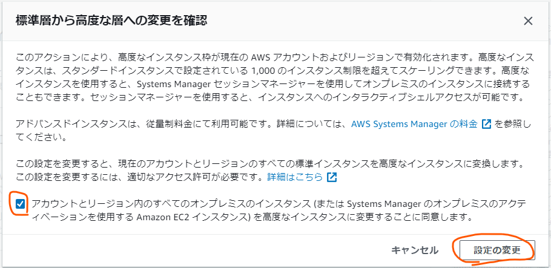

# AWS経由で遠地にあるRaspberryPiを操作する方法


---
## 準備1.AWS Systems Manager(以下、SSM）で接続のためのアクティベーションを作成
- AWS Systems Managerを開く
- 「ハイブリッドアクティベーション」を選択し「アクティベーションの作成」をクリック
- 以下の内容を登録して「アクティベーションの作成」をクリック
  - アクティベーションの説明（任意）：（例）RaspberryPi接続用
  - インスタンス制限（このアクティベーションで登録する端末数）：`1`
  - IAMロール：（新規作成するか、既存のロール※を選択する）
  - アクティベーションの有効期限：（`yyyy-MM:dd HH:mm`形式で`30日以内の日付`を設定）
  - デフォルトのインスタンス名：（任意）  
    ※必要となるIAMロール（Policyには `AmazonSSMManagedInstanceCore` を設定すること）  
    ``` json
    {
      "Version": "2012-10-17",
      "Statement": {
          "Effect": "Allow",
          "Principal": {"Service": "ssm.amazonaws.com"},
          "Action": "sts:AssumeRole"
      }
    }
    ```
- 実行後に表示される「Activation Code」「Activation ID」を控えておく。  


---

## 準備2.Raspberry Piに、SSM Agentをインストールする
- SSMを起動するためのユーザを作成する（例：ssm-user）
``` bash 
# ユーザを作成
$ sudo useradd ssm-user

# ユーザに作業フォルダを設定
$ sudo mkdir /home/ssm-user
$ sudo chown ssm-user:ssm-user /home/ssm-user

# nanoエディタでsudoersを編集(新規)
$ sudo nano /etc/sudoers.d/ssm-user

以下の内容を設定して保存(Ctrl + X > y(es) > Enter)
---
ssm-user ALL=(ALL) NOPASSWD: ALL
```

- SSM Agentをインストール
``` bash 
$ mkdir /tmp/ssm
$ sudo curl "https://s3.ap-northeast-1.amazonaws.com/amazon-ssm-ap-northeast-1/latest/debian_arm/amazon-ssm-agent.deb" -o /tmp/ssm/amazon-ssm-agent.deb
$ sudo dpkg -i /tmp/ssm/amazon-ssm-agent.deb
$ sudo service amazon-ssm-agent stop
```

 - SSM をアクティベーションする
``` bash 
# []には準備1で控えた内容を設定する
$ sudo amazon-ssm-agent -register -code [activation-code] -id [activation-id] -region ap-northeast-1

# 実行後、以下のようなメッセージが出れば登録成功
Error occurred fetching the seelog config file path:  open /etc/amazon/ssm/seelog.xml: no such file or directory
Initializing new seelog logger
New Seelog Logger Creation Complete
2022-05-05 01:09:37 WARN Could not read InstanceFingerprint file: InstanceFingerprint does not exist.
2022-05-05 01:09:37 INFO No initial fingerprint detected, generating fingerprint file...
2022-05-05 01:09:38 INFO Successfully registered the instance with AWS SSM using Managed instance-id: mi-******************
```

- アクティベーションが正常に行われたかを、AWSコンソールから確認する。

  - AWSで「Systems Manager」-「フリートマネージャ」を選択する。

  - ノードの一覧に、上述の「mi-******************」が表示されていることを確認する。   


- SSM Agentを起動する

``` bash
$ sudo service amazon-ssm-agent start
```

---

## 準備3.AWSのSystemManagerでアドバンスドインスタンスを有効化

<span style="color:red;font-weight:bold">
注意<br>
この項の設定を行うと、従量課金が発生しますのでご留意ください<br>
料金等、よくご確認のうえ、適用をお願いします。<br>
</span>

- AWSコンソールのサービスメニューから「System Manager」を選択
- サイドメニューから「フリートマネージャ」を選択
- 準備2で作成されたノートID「mi-******************」をチェックし、「アカウント管理」>「インスタンス枠の設定」を選択
- 「アカウント設定の変更」をクリック。以下が表示されるので、チェックをいれて「設定の変更」をクリック。


本設定によって、アドバンスドインスタンスが有効化され、以降、無効化するまでの間、常時「0.00695 USD/h」(≒20円/日 ※本記事記載時点(2022/5/23))が発生する。  

---

## 接続手順1.AWSコンソールから接続
- AWSコンソールのサービスメニューから「System Manager」を選択
- サイドメニューから「フリートマネージャ」を選択
- 準備2で作成されたノートID「mi-******************」をチェックし、「ノードアクション」>「ターミナルセッションを開始する」を選択
- 以下のコマンドを実行
  ``` bash 
  $ su - pi
  パスワード：（piユーザのパスワードを入力）

  pi@raspberrypi:~$
  ```

---

## 接続手順2.EC2端末(Amazon Linux2)から接続

- EC2のターミナルから以下を実行

  ``` bash 
  # session manage plugin インストール 
  $ curl "https://s3.amazonaws.com/session-manager-downloads/plugin/latest/linux_64bit/session-manager-plugin.rpm" -o "session-manager-plugin.rpm"
  $ sudo yum install -y session-manager-plugin.rpm 

  # SSM権限のあるIAMのアクセスキー、シークレットキーを設定
  $ aws configure
  AWS Access Key ID [None]: AKI*************PLE
  AWS Secret Access Key [None]: wJa***********************************KEY
  Default region name [None]: ap-northeast-1
  Default output format [None]: 

  # 接続実行
  $ aws ssm start-session --target mi-****************** 
  ```

---
 
## 後始末
使用後は、課金を止めるためアドバンスドインスタンスを無効化すること。操作は「準備3」の操作をもう一度行うこと。確認メッセージが「高度な層から標準層への変更」と表示される。
